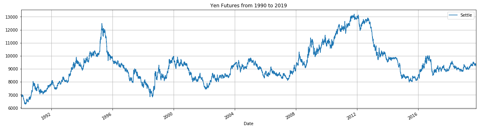
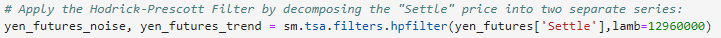
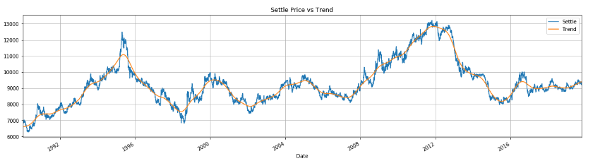

# Time_Series_Analysis

## A Yen for the Future

## Background

The financial departments of large companies often deal with foreign currency transactions while doing international business. As a result, they are always looking for anything that can help them better understand the future direction and risk of various currencies.

Hedge funds are also keenly interested in anything that will give them a consistent edge in predicting currency movements.

 In this repository, we will test the many time-series tools that we have learned in order to predict future movements in the value of the Japanese yen versus the U.S. dollar.

The following tasks will be tested to see if we can form an edge in predicting currency trends:

1.Decomposition using a Hodrick-Prescott Filter: This will allow us to decompose the price of the Yen into trend and noise and filter out short term fluctuations.
2. Forecasting using an ARMA Model: Auto-regressive Moving Average models allows us to predict future values based on past values at a specific lag.
3. Forecasting using an ARIMA Model: ARIMA models can take non-stationary data and predict future values without having to seperate the "noise" from the "trend".
4. Forecasting Volatility using GARCH models: Generalized Autoregressive Conditional Heteroskedasticity models allow us to predit near term volatility.

Using these techniques we will try to see if we can predict future movements in the Japanese Yen.

- - -

### Files

[Time-Series Notebook](Starter_Code/time_series_analysis.ipynb) This file contains The Hodrick-Prescott Filter, ARMA modeling, ARIMA modeling & GARCH modeling

[Linear Regression Notebook](Starter_Code/regression_analysis.ipynb) This file contains a Linear Regression model 

[Yen Data CSV File](Starter_Code/yen.csv)

- - -

#### Time-Series Forecasting

In this notebook, we will load historical Dollar-Yen exchange rate futures data and apply time series analysis and modeling to determine whether there is any predictable behavior to forecast future prices. Below you have our complete set of Dollar-Yen Settle Prices dating back to 1990. We will be using this data to test these new techniques we learned.

The first technique we will perform is the Hodrick-Prescott Filter to decompose the trend from the noise. This will allow us to see if there are any long term trends to follow in this relationship. We will start by seperating the noise from the trend. After toying with the lambda settings, we found one that would smooth out the noise and give us a clear view of the trend.

 
 In the below plot of the Yen Futures, we can see that Trend line (yellow) follows the overall trend without being overly sensitive to the noise of the daily swings in price.

1. Decomposition using a Hodrick-Prescott Filter (Decompose the Settle price into trend and noise).
2. Forecasting Returns using an ARMA Model. **(Stationary)**
3. Forecasting the Settle Price using an ARIMA Model. **(Non-Stationary)**
4. Forecasting Volatility with GARCH.

Use the results of the time series analysis and modeling to answer the following questions:

1. Based on your time series analysis, would you buy the yen now?
2. Is the risk of the yen expected to increase or decrease?
3. Based on the model evaluation, would you feel confident in using these models for trading?

#### Linear Regression Forecasting

In this notebook, you will build a Scikit-Learn linear regression model to predict Yen futures ("settle") returns with *lagged* Yen futures returns and categorical calendar seasonal effects (e.g., day-of-week or week-of-year seasonal effects).

Follow the steps outlined in the regression_analysis starter notebook to complete the following:

1. Data Preparation (Creating Returns and Lagged Returns and splitting the data into training and testing data)
2. Fitting a Linear Regression Model.
3. Making predictions using the testing data.
4. Out-of-sample performance.
5. In-sample performance.

Use the results of the linear regression analysis and modeling to answer the following question:

* Does this model perform better or worse on out-of-sample data compared to in-sample data?

- - -

### Hints and Considerations

* Out-of-sample data is data that the model hasn't seen before (Testing data).
* In-sample data is data that the model was trained on (Training data).

- - -

### Submission

* Create Jupyter Notebooks for the analysis and host the notebooks on GitHub.

* Include a Markdown that summarizes your models and findings and include this report in your GitHub repo.

* Submit the link to your GitHub project to Bootcampspot.
